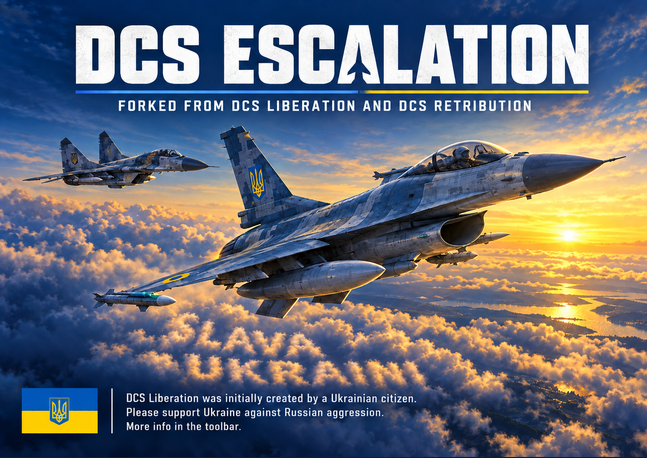

  

# DCS Escalation

A dynamic campaign generator for DCS World, and the third name in one line of work:
**DCS Liberation** was written by shdwp and rewritten by Khopa; **DCS Retribution**
was forked from it in 2022 and is still
[actively developed](https://github.com/dcs-retribution/dcs-retribution). **DCS
Escalation** is a personal fork of Retribution by **juanjux**, carrying features and
fixes that are not (yet) in it — some of them adapted from the
[414Ret fork](https://github.com/bradyccox/414Ret).

Everything Retribution does, Escalation does. What follows is what it does on top.

# What is this exactly?

In a nutshell, Escalation is turn based dynamic campaign generator where every turn is about 4 hours if passing time. Using a UI separate from DCS,
you decide what packages and flights will do, what targets will be attacked, what you will 
improve of your air defenses and money-producing buildings, et cetera. You could assign yourself as a player (or several players, for multiplayer missions) to any of the defined packages. 
Then you would click on "take off", and it will generate a DCS mission. You would then hop into DCS, load and play that mission, and everything that happened during it would be recorded and persisted 
for the next turn, then you would go back to Escalation UI and repeat, until either your side (OWNFOR) or the enemy one (OPFOR) wins.

# What does Escalation adds over it's ancestors Liberation and Retribution?

## LLM-controlled OPFOR (REST API + MCP)
An external LLM (Claude, ChatGPT, etc) can play the enemy commander. A REST API and an MCP server expose a
token-frugal turn context (forces, targets, threats, economy, naval, motorpools, runway
states, plus an optional rendered map image) and full player parity to act on it:
packages and flights, buying and selling, front-line stances, squadron relocation,
fleet movement, repairs and rebuilds. The LLM gets its own briefing at `/start` and
`/howtoplay`. Just copy the local URL from the button to Claude Coword, ChatGPT Codex, Grok build
or any other LLM that has a local interface, and start playing with it controlling OPFOR.

**This is probably the biggest difference and how Escalation is meant to be played**; having a reasonably competent enemy totally 
changes the engagement and fun factor of every campaign. While the current version still keeps the inherited dumb OPFOR planner, 
it will probably be removed in the future.

## Live Pilots

A squadron of people instead of a list of slots with RPG-like interactions. Switched on, a pilot has a name, a
rank and a history, and DCS shows him by name in the cockpit label rather than as
"Pilot #2". What happens to him is remembered, and it feeds back into how he flies:
the campaign is not only aircraft and fuel any more, it is also who is left and how
they are holding up.

- **He earns his rank.** Experience comes from flying the mission and from what he
  destroys, and each rung of it is a real DCS skill level — a promotion makes him
  measurably better in the air. Ranks are named in the nation's own convention.

- **He has good weeks and bad ones.** Morale moves with everything that happens to
  him: a mission flown, a kill, a promotion, a squadron mate lost, a week at home. It
  shifts the rung he actually flies at, and at the bottom of the scale he refuses to
  fly and may walk away for good. Leave is worth granting.

- **He gets used to it.** A man who has been through a run of bad turns is harder to
  shake, likelier to walk away from a wreck, and slower to get close to anybody —
  which is the price of it.

- **He has opinions about the others.** Every pair of pilots has a relationship, and a
  directed one: what he thinks of a man and what that man thinks back need not agree.
  A crew that gets on flies better and looks after its own when somebody goes down;
  one that does not pays for it the same way. Friends ask for leave together, and
  losing one costs more than losing a stranger.

- **And it is all readable.** Double-clicking a pilot opens his record: his rank and
  what the next one costs, every kill grouped the way he would tell it and openable to
  the individual ones, what he has survived, how he died and who did it, his morale
  with the log of everything that moved it, and his relationships in both directions.
  An optional cheat strip renames, promotes, heals and revives.
  
Still to come:

- **Rivals.** Two pilots who cannot stand each other try to out-score one another in
  the same flight or package, and fly better for it. Maverick and Ice. Over time a
  rivalry tends to turn into friendship.

- **Mate's quests.** Now and then a pilot asks for something specific — an escort on
  his next mission, a SEAD sortie flown alongside an experienced hand. Optional, and
  worth experience and friendship to both men when it comes off.

- **The cantina.** One place for the whole crew room: who gets on with whom, a man's
  history and statistics, morale across the squadron, leave requests, and whatever is
  worth a warning.

  
## Interface

- **The interface has been rebuilt.** Dialogs, lists and panels were redrawn to one
  visual language.

  

- **Coordinates anywhere on the map, in the format of choice.** A picker reads any
  point, the objective dialog gives the coordinates of every unit and building, and both
  copy to the clipboard. DMS, decimal minutes, decimal degrees and MGRS, set on the new
  General settings page.
  ([#296](https://github.com/juanjux/dcs-escalation/pull/296))

- **A point on the map can be saved into the player's aircraft**, as a waypoint or a
  markpoint, with the height of the ground under it looked up from an open elevation
  model. Mostly useful for targets: a fleet's last reported position, a power station,
  anything the flight plan does not already pass through.

  They are kept **out of the route**, so they cannot collide with the flight plan the
  mission generated. The Hornet and the Viper get them numbered after the last route
  waypoint and on route sequence 2 -- SEQ1 is still the route. The A-10, whose navigation
  computer works differently, gets them on a flight plan of its own called EXTRA, leaving
  MSN untouched.

- **A window for what you are flying this turn**, opened with *Playable aircraft* on
  the top panel: each aircraft with its squadron and package, and the points saved to it, which
  can also be typed or pasted in by hand instead of clicked on the map. They also get a kneeboard page of their own.
  ([#343](https://github.com/juanjux/dcs-escalation/pull/343),
  [#354](https://github.com/juanjux/dcs-escalation/pull/354),
  [#360](https://github.com/juanjux/dcs-escalation/pull/360),
  [#364](https://github.com/juanjux/dcs-escalation/pull/364))

  

## IADS Reworked

- **Custom Skynetfork**, [juanjux/Skynet-IADS](https://github.com/juanjux/Skynet-IADS): upstream 3.3.0 with its
  HARM fixes, plus `ActMobile` and the four High Digit SAMs systems (S-400, S-300V4,
  SAMP/T, Pantsir-SM), and many, many fixes and performance improvements including (optional) culling of the network based on the
  planned flight packages

- **Batteries with their own generator can survive a power grid cut.** A Patriot's EPP-III or a
  SAMP/T's MGE keeps the site powered when the nearest substation is bombed until the defined
   generator unit itself is destroyed.

- **IADS infrastructure can be rebuilt.**
  
- **Autonomous and dark sites are told apart from working ones.** A dark site draws no range rings
  and its health bar color and tooltip says why, network links are coloured by state.
  
- **Radar, missile battery and jamming sites are interchangeable** You can buy any of these in the place of others.
  They still have distinct icons.
  
- **Many fixed on campaigns that used IADS but had some errors in the topology or configuration.**

## Kneeboards
- **Friendly-packages list** plus a **package-targets map** page.
  ([#11](https://github.com/juanjux/dcs-escalation/pull/11))
- **DEAD/SEAD target page** — one waypoint per target with an STPT column.
  ([#18](https://github.com/juanjux/dcs-escalation/pull/18))
- **COMM2 presets** mirrored from COMM1 on twin-radio aircraft (plus an
  F/A-18-family COMM1/COMM2 fix) and clearer auto-assigned **TACAN** codes.
  ([#12](https://github.com/juanjux/dcs-escalation/pull/12),
  [#20](https://github.com/juanjux/dcs-escalation/pull/20))
- The **Support Info** page spans several pages when a package has many flights, instead
  of silently pushing the AEW&C, tanker and JTAC tables off the bottom of one.
  ([#69](https://github.com/juanjux/dcs-escalation/pull/69))

## Missions, AI & tasking
- **A flight can arrive lined up with the runway.** The route ends at the airfield,
  which is a point and not a direction, so the last leg arrives on whatever heading the
  one before it left. An optional ALIGN waypoint goes on the approach course of the
  **active** runway -- the one the campaign works out from the wind, the same one the
  kneeboard and the ATC give -- a settable distance out and at the height a three-degree
  slope puts it. On by default, under Mission Generator.

  Carriers get one on their base recovery course, at the position the ship will have
  reached by the time the flight lands: fifty miles astern by default, which is where a
  Case III approach starts. DCS exposes a runway's heading but no coordinates, so at a
  field with more than one runway the course is correct but the waypoint can be
  laterally offset. In calm air the ILS runway is preferred, which is usually the one
  the field's reference point sits on.

  The hold point works the same way at the departure end, under its own setting: the
  flight climbs out along the runway it took off from, or a carrier's recovery course,
  instead of turning straight for the target. How far out it sits is settable too.

- **Realistic CAS** — an experimental, off-by-default Mission Plugin that makes
  ground targets something to discover instead of immediately available to every
  AI attacker. Both sides search using visual, EO/IR and ground-radar observations,
  with terrain line of sight and approximate weather, daylight and cover effects.
  Firing reveals a group immediately; observed contacts expire after a configurable
  time. Ground units also spot enemies, and revealing one vehicle reveals its group.
  Fixed map SAM sites stay known; frontline SAMs participate in the fog. F10 and
  weapon accuracy are unchanged. Enable **Realistic CAS (experimental)** in Mission
  Plugins; **TIC and Moose Autolase must be disabled**. CTLD logistics can remain
  enabled with **JTAC autolase targets** off; runtime-created units are not yet
  registered in the fog. Legacy generated
  JTACs are temporarily omitted. Campaign-scale tuning and replacement JTACs remain
  pending. [Plugin details](resources/plugins/realisticcas/README.md).
  ([#195](https://github.com/juanjux/dcs-escalation/pull/195))
  
- **Automatic refuelling waypoint and tanker added only if needed.** A package's route is costed leg by leg against and estimation of fuel usage based on the plane, speed and height
  and a flight that will not make it gets a dialog about adding a refuelling waypoint after the target and optionally a tanker in the same package.
  ([#211](https://github.com/juanjux/dcs-escalation/pull/211),
  [#213](https://github.com/juanjux/dcs-escalation/pull/213),
  [#214](https://github.com/juanjux/dcs-escalation/pull/214))
  
- **Mission Log** (plugin, off by default) — a running commentary of what happens to your
  side while you fly: who shot down whom and with what, which targets went down, who
  ejected, who crashed. 
  ([#120](https://github.com/juanjux/dcs-escalation/pull/120))
  
- **Turn times from the sun** — the four turn slots are derived from the theater's
  latitude and the campaign date rather than one fixed window per map, so a December dawn
  turn no longer starts in the pitch dark. North of the arctic circle the slots hang off
  solar noon and stay dark. A theater keeps its old table with `daytime_mode: table`.
  ([#113](https://github.com/juanjux/dcs-escalation/pull/113))
  
- **ATMOS-X live weather** — with the ATMOS-X pack selected, the turn's weather can be a
  real METAR observation fetched through the ATMOS-X CLI, for a station picked
  automatically or set by ICAO. Fetched when the turn is built, so kneeboards, the active
  runway and the carrier's course into wind all match.
  ([#101](https://github.com/juanjux/dcs-escalation/pull/101))
  
- **Custom cloud preset packs** — a campaign setting that makes a community cloud-preset
  mod's presets available to the generator: Bandit's Cloud Presets, Weather 2.0 or
  ATMOS-X, one at a time since the packs reuse the same preset keys.
  ([#53](https://github.com/juanjux/dcs-escalation/pull/53))
  
- **Smart Threat Reaction** — a plugin that keeps AI aircraft at Passive Defense and
  switches only the flight a missile is actually guiding on to Evade Fire, so one SAM
  launch no longer sends 200 planes defensive and aborting their mission, only the flight of the targeted plane does.
  ([#63](https://github.com/juanjux/dcs-escalation/pull/63))
  
- **Campaign Doctrine: "non-combat (crash) air losses don't count"** — AI crashes and
  collisions DCS credits to no weapon no longer deplete a squadron or kill the pilot.
  This makes campaigns longer and harder with more planes in the air after some turns.
  ([#1](https://github.com/juanjux/dcs-escalation/pull/1))
  
- **One-way air assault ("remain at destination")** — a helicopter-only option: the helos
  land at the objective and do not return, so the assault uses their full ferry range. At
  turn end the survivors redeploy there if you capture the base, otherwise they are lost.
  ([#64](https://github.com/juanjux/dcs-escalation/pull/64))

- **Automated ground-object / building repair** — the HQ repairs damaged SAM sites,
  vehicle groups and buildings each turn, with tunable budgets and priorities, and the
  turn panel reports what each side finished and what is still in progress.
  ([#29](https://github.com/juanjux/dcs-escalation/pull/29),
  [#43](https://github.com/juanjux/dcs-escalation/pull/43))
  
- **Set loadout as default** — a named payload can be made the default for an aircraft
  and mission type, so new flights start with it. 
  ([#49](https://github.com/juanjux/dcs-escalation/pull/49),
  [#51](https://github.com/juanjux/dcs-escalation/pull/51))
  
- **A fuel estimate for the plan**, beside the route total and the per-leg distances:
  taxi, the legs at their own climb/cruise/combat rates, the landing reserve and a
  margin, against what the flight carries. Only 24 aircraft have measured consumption
  figures; the rest are estimated from their capacity over a nominal range for their
  kind, leaning high.
  ([#190](https://github.com/juanjux/dcs-escalation/pull/190),
  [#189](https://github.com/juanjux/dcs-escalation/pull/189),
  [#191](https://github.com/juanjux/dcs-escalation/pull/191))
  
- **The debriefing is kept in the save**, so it can be reopened from the Misc bar after
  the session that produced it.

## Campaigns
- **Battle for Area 51: both sides get a real IADS.** Red's west, central and east
  groups shared no node and drew as three networks a few miles apart; the comms are
  cross-linked into one and the three power stations feed a single grid, so the network
  survives losing a station and goes dark all at once when the last one falls. Blue had
  nothing but the bunker -- no radar, no comms, no power, so every site of its own went
  autonomous whatever happened -- and gets two early-warning radars, three relay towers
  and two power stations, so it is one working network too.
  ([#221](https://github.com/juanjux/dcs-escalation/pull/221),
  [#225](https://github.com/juanjux/dcs-escalation/pull/225))
- **Syria — Invasion of the Canary Islands 2030, new campaign**, with the **Spain 2030** and
  **Morocco 2030** factions. A rework of NoGoodNews' original: both sides fly what they
  are expected to field by 2030 (so it required the Eurofighter and F35 mods, which this fork also adds support for), and both navies are built from real hulls with pinned compositions. Air defenses are about a third lighter than the original, the IADS is fully wired, and every base on a front has a motor pool holding its undeployed armor as a bombable target and Morocco has been made stronger to better balance the campaign.
  ([#98](https://github.com/juanjux/dcs-escalation/pull/98))
  
- **South Atlantic — Gran Polvorin gets an air defence network.** Both sides are now wired into one network each,
  
- with vehicle depots and
  a GPS jamming site per side.
  ([#290](https://github.com/juanjux/dcs-escalation/pull/290),
  [#295](https://github.com/juanjux/dcs-escalation/pull/295))

- **GPS jamming (a feature from the 414ret fork) is available in every modern campaign.** 
  ([#183](https://github.com/juanjux/dcs-escalation/pull/183))

## Modding & data
- **F-15EX Eagle II, F-15C EG (Golden Eagle) and Eurofighter Typhoon** mod aircraft.
  ([#31](https://github.com/juanjux/dcs-escalation/pull/31),
  [#32](https://github.com/juanjux/dcs-escalation/pull/32),
  [#33](https://github.com/juanjux/dcs-escalation/pull/33))
  
- **High Digit SAMs Ultimate Compilation, as a second selectable build.** The two builds
  cannot both be installed, so the New Game wizard offers them as mutually exclusive
  choices and a faction only sees the presets its chosen build ships. Campaign authors
  have to wire the new sites in themselves.
  (branch [`juanjux/hds_2_1_0_and_ultimate`](https://github.com/juanjux/dcs-escalation/tree/juanjux/hds_2_1_0_and_ultimate),
  upstream [#956](https://github.com/dcs-retribution/dcs-retribution/pull/956))

## Taken and adapted From the 414Ret fork

These are adapted from the [**414Ret** fork](https://github.com/bradyccox/414Ret)
(414th Joint Fighter Group), with thanks to its authors — 414Ret bundles many
more features; listed here are the ones incorporated into this fork, each
crediting the original 414Ret author (the recent additions land via attributed
PRs on `juanjux-dev`, so any can be reverted cleanly). TIC vendors Grendel's
TIC script (MIT).

414Ret moves fast, so its feature list is re-reviewed periodically and only a
part of it is taken: every feature carried here is one more thing to reconcile
on each upstream sync, so the bar is "clearly worth the maintenance", not
"interesting". The last review covered the 1087 commits between 2026-06-23 and
2026-08-22. Ports are cherry-picked with the original author preserved —
`git log --author=bradyccox` is the authoritative list of what has been taken,
and it is longer than this section.

- **Troops In Contact (TIC)** — a dynamic frontline: ground forces actually fight
  along the FLOT (with ambient fire) instead of behaving as two static walls.
  
- **Mission Impact debrief summary** — bases captured/lost, runway damage and a
  both-sides loss overview above the casualty tables.
  
- **AI routes around the ground battle** — the active front line becomes a
  navmesh routing hazard, so transit flights detour around it.
  
- **Frontline units spread along the line** instead of stacking laterally.

- **Escorts can defend themselves before the JOIN point** — an escort was generated at an
  ROE that only permits engaging *designated* targets, and the task that designates them
  attaches at JOIN. Escorts now spawn able to return fire and escalate at JOIN.  
  
- **Coastal batteries can engage ships** — land-based anti-ship sites fire on their own at
  hulls in range, the way fleets do. Off by default (a mod battery firing anti-ship
  missiles has crashed DCS).
  
- **DEAD reachability gate** — the planner no longer marks a SAM "cleared" when the
  assigned flight cannot actually reach it.
  ([#37](https://github.com/juanjux/dcs-escalation/pull/37), porting 414Ret #83)
  
- **Weapons coverage refresh** — more modern PGMs and air-to-air missiles across
  factions, without the era date-gating (our introduction years are kept).
  ([#35](https://github.com/juanjux/dcs-escalation/pull/35), porting 414Ret #82) 
  
- **Two guidance radars per SAM site** — every layout fielded exactly one engagement
  radar, so a single anti-radiation missile was a functional site kill. The Track Radar
  slot doubles across the generic layouts, SA-2, SA-3, SA-5, S-300, HQ-22, S-350, the
  mixed SA-2/SA-3 site, the reinforced SA-6, NASAMS-3 and Sky Sabre, with the second
  position 45-121 m from the first. (porting 414Ret #582)
  
- **More SAM site layouts, tighter EWR radar pool** — dedicated battery layouts
  instead of every site reusing the same handful of shapes.
  
- **Bulk flight altitude** — "apply to all" for en-route waypoint altitude, and the
  per-waypoint arrows step 1000 ft instead of 1 ft. (porting 414Ret #805)

- **Ship groups generate as task groups** — a group was N copies of one hull, so a carrier
  screen was four identical destroyers. A slot now takes one type per position, drawn from
  the lead's own class family and capped at three types. Naval layouts only; the buy menu
  still gives exactly the hull that was picked.
  ([#104](https://github.com/juanjux/dcs-escalation/pull/104), porting 414Ret #764)
  
- **Every generated mission is archived** to
  `Missions/Retribution Archive/<campaign>_turn<NN>_<timestamp>.miz`, self-pruning, with
  the fixed output path unchanged. Each turn used to overwrite the mission just flown.
  ([#103](https://github.com/juanjux/dcs-escalation/pull/103), porting 414Ret #615)
  
- **GPS jamming** — a JDAM, JSOW, JASSM or SLAM-ER released against a target inside an
  enemy jamming bubble lands off the aimpoint, further off the deeper in. Laser, TV and
  anti-radiation weapons are unaffected, and killing the jammer restores accuracy on the
  next weapon in the same mission. The jammer is an ordinary bombable ground unit and is
  not a SEAD target. Off by default.
  ([#109](https://github.com/juanjux/dcs-escalation/pull/109), porting 414Ret #778)
  
- **Finite anti-ship magazines, and a staggered weapons release** — a warship group
  carries a campaign stock of anti-ship missiles that never rearms, and a group that runs
  dry drops to return-fire. Optionally, ships spawn on return-fire and are released to
  weapons-free one group at a time. Both off by default.
  ([#106](https://github.com/juanjux/dcs-escalation/pull/106), porting 414Ret #766)
  
- **The AI buys its better ground units more often** — the ground buy rolled uniformly
  over everything affordable of the right class. The roll is weighted by price; a
  weighting, not a maximum, so the cheap end still appears.
  ([#105](https://github.com/juanjux/dcs-escalation/pull/105), porting the
  capability-weighted half of 414Ret #68)

## Removed from upstream

- **Anubis' C-130J-30 Super Hercules mod**, unsupported here and by its own authors. It
  was the only aircraft that could drop paratroopers, and it did it as a carpet-bombing
  task releasing the mod's own thirty-soldier store — something the stock C-130J-30 does
  not carry. Saves, factions and campaigns that used it read the stock C-130J-30 instead.

- **Fast forward.** It never worked well enough to be worth the machinery. Take Off hands
  DCS the mission at the time it was planned for.  
  ([#176](https://github.com/juanjux/dcs-escalation/pull/176))
  
- **Four obsolete or duplicated plugins removed.** EWRS is the 2016 script BigEye EWR was rewritten from; Mbot's Call
  Artillery only ever answered a player flying Armed Recon, while Carsten's answers
  anyone in range; the C-130 cargo script is for a mod their authors don't support anymore; and the EW
  Jammer script cannot model jamming honestly without engine support.
  ([#175](https://github.com/juanjux/dcs-escalation/pull/175))
  
- **DCS: Pretense support.** A one-way export into a second, parallel game that never
  comes back to the Escalation campaign — ~5,400 lines of Python plus 590 KB of
  third-party Lua, carried through every upstream sync, for a project that is no longer
  maintained on either side. Gone with it: `game/pretense/`, the plugin resources, the
  toolbar actions, the settings page, `FlightType.PRETENSE_CARGO` and the four `*_full`
  campaigns tuned for it.

---

For installation and general usage, see the upstream
[DCS Escalation](https://github.com/dcs-retribution/dcs-retribution) documentation.
