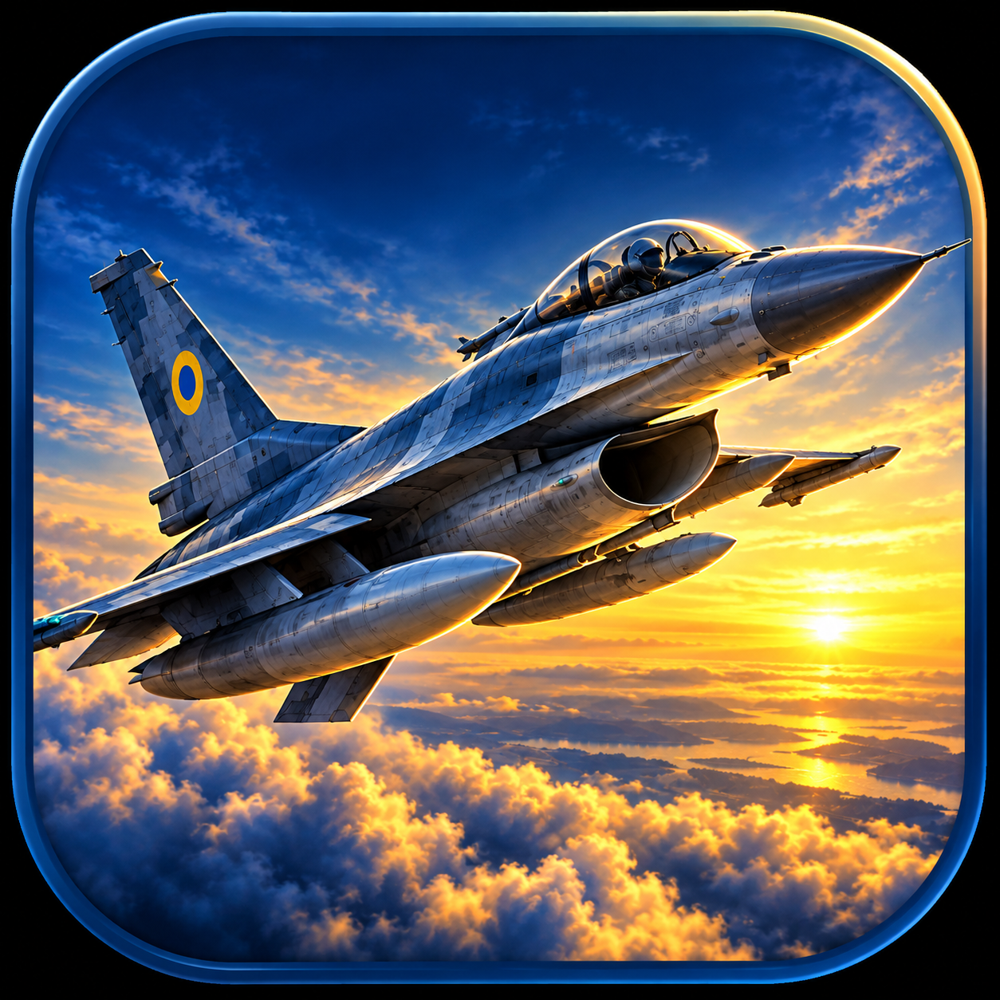
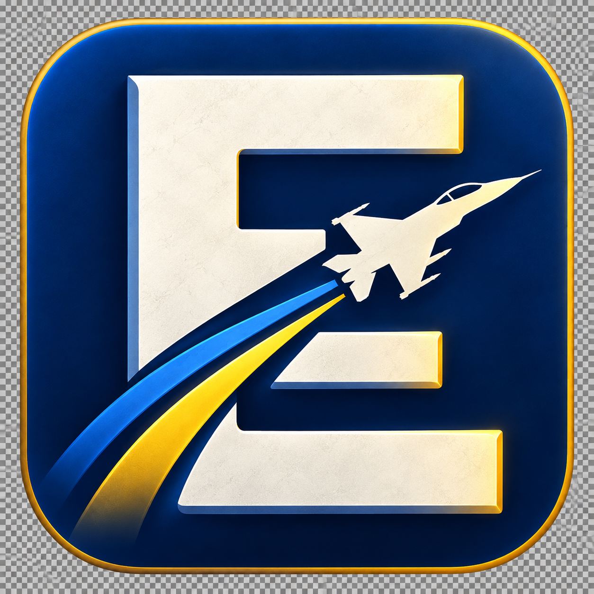
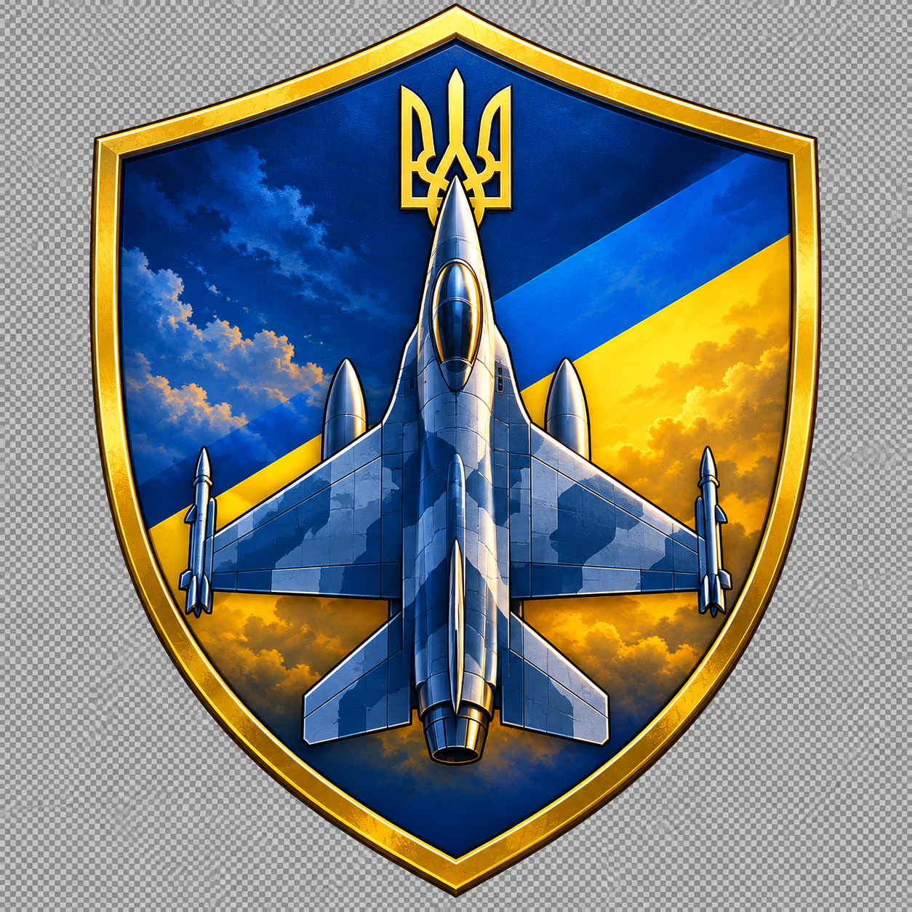

# DCS Escalation executable icon proposals

Generated with the built-in image generation tool. The accepted dawn splash is the visual reference. The current `07-ukraine-background.png` adds a blue/yellow Ukrainian flag background to the selected outlined F-16. See [background revision](ukraine-background.md) and [production exports](../export_assets.py) for the executable, Qt window and browser icon outputs.

The first three proposals below were rejected. The current icon has an opaque flag background and multi-resolution ICO exports; the earlier transparent version and previews remain for design history.

## 01-dawn-falcon

### Prompt

Create one square 1024x1024 raster Windows desktop application icon proposal for DCS Escalation, a combat flight simulator dynamic campaign generator. The input image is ONLY a color, subject and mood reference from the user-approved splash; do not copy the poster layout or its text. Blue and golden yellow Ukrainian tribute. Icon itself fills 88-92% of canvas with generous safe margin. Transparent alpha outside the icon silhouette, no checkerboard drawn, no mockup desk, no captions, no watermarks. Strong immediately readable silhouette at 32x32 and 48x48, avoid tiny detail, no full application name, no footer words. Premium polished aviation app identity. Single isolated icon, not a sheet, no size comparison panels. Design A: cinematic F-16 dawn badge. A rounded-square dark navy tile encloses a single realistically illustrated silver-blue F-16 banking upward to the upper right, unmistakable single-tail F-16 shape with belly intake. Aircraft large and dominant, simplified high-contrast detail, beautiful golden rim light. Background only two broad masses: deep blue sky above, luminous golden horizon and subtle clouds below. One small blue-yellow aircraft marking, no lettering or extra heraldry. Inspired by approved realistic splash but optimized as a compact icon, not a miniature busy painting. No second airplane, no weapons firing.

## 02-escalation-e

### Prompt

Create one square 1024x1024 raster Windows desktop application icon proposal for DCS Escalation, a combat flight simulator dynamic campaign generator. The input image is ONLY a color, subject and mood reference from the user-approved splash; do not copy the poster layout or its text. Blue and golden yellow Ukrainian tribute. Icon itself fills 88-92% of canvas with generous safe margin. Transparent alpha outside the icon silhouette, no checkerboard drawn, no mockup desk, no captions, no watermarks. Strong immediately readable silhouette at 32x32 and 48x48, avoid tiny detail, no full application name, no footer words. Premium polished aviation app identity. Single isolated icon, not a sheet, no size comparison panels. Design B: bold Escalation monogram. A deep navy rounded-square tile, one oversized sculptural ivory capital "E" (only this letter) with three clean broad horizontal strokes; an unmistakable small fighter jet silhouette climbs diagonally up-right through its negative space, integrated rather than pasted on. Two restrained blue and golden yellow upward-sweeping accents suggest ascent and Ukraine. Extremely clean, crisp, flat-to-subtly-beveled finish, broad shapes, very high contrast, no tiny lines, no clouds, no decorative text. The E must read as E, not F. The jet must remain anatomically coherent and recognizable. Original app mark.

## 03-ukraine-insignia

### Prompt

Create one square 1024x1024 raster Windows desktop application icon proposal for DCS Escalation, a combat flight simulator dynamic campaign generator. The input image is ONLY a color, subject and mood reference from the user-approved splash; do not copy the poster layout or its text. Blue and golden yellow Ukrainian tribute. Icon itself fills 88-92% of canvas with generous safe margin. Transparent alpha outside the icon silhouette, no checkerboard drawn, no mockup desk, no captions, no watermarks. Strong immediately readable silhouette at 32x32 and 48x48, avoid tiny detail, no full application name, no footer words. Premium polished aviation app identity. Single isolated icon, not a sheet, no size comparison panels. Design C: compact aviation squadron shield. A navy shield with a thick restrained golden border; inside a large silver-blue fighter aircraft seen straight from above, nose pointing upward, strong symmetrical silhouette and no miniature panel lines. Behind it, broad blue and yellow diagonal fields. A small clear gold Ukrainian trident at the crown of the shield, separated above the aircraft so the two silhouettes don't merge. Elegant enamel insignia finish rather than embroidered cloth, readable bold masses. No letters, ribbons, stars, laurels or extra symbols. Transparent outside shield.
