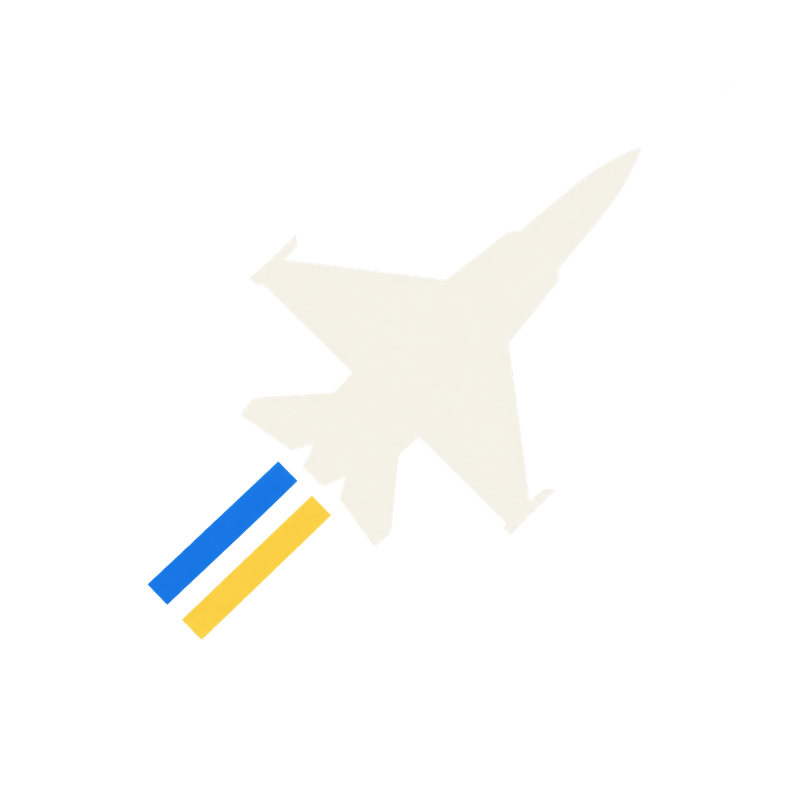
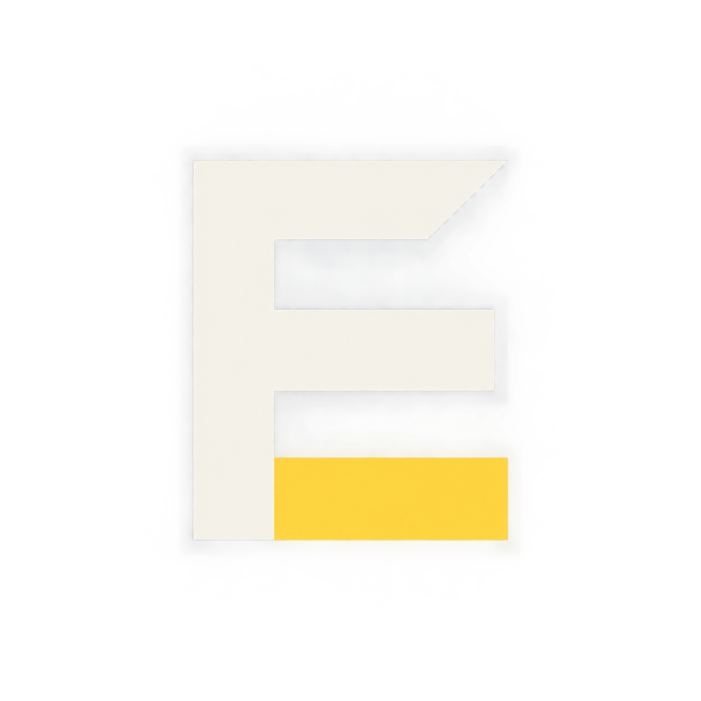
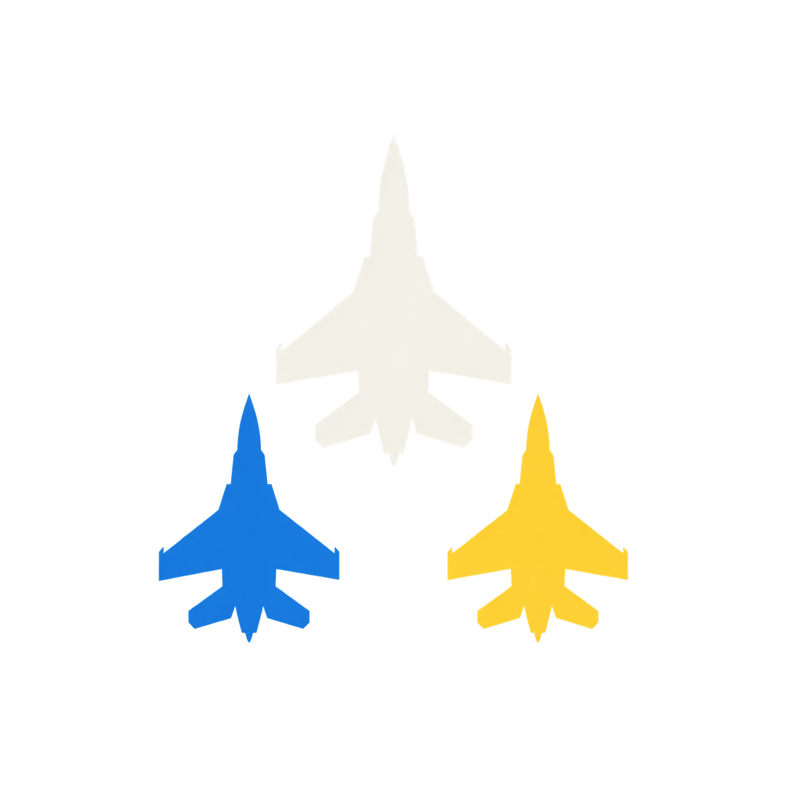

# Minimal icon proposals

Generated with the built-in image generation tool, without reference images. The user selected proposal 04, then approved its outlined refinement in `04-simple-jet-outlined.png`, which is installed as the application icon.

## 04-simple-jet

Generate a single extremely simple flat raster application icon concept for "DCS Escalation", an aviation strategy application. Square canvas. This is a minimalist graphic mark, NOT an illustration, photograph, badge, game cover, enamel pin or 3D object. Matte uniform dark navy #101D35 background fills the entire square, edge to edge. Use only flat ivory #F5F3E9, Ukrainian blue #1479DB and yellow #FFD43B shapes on navy. No gradients, lighting, shadows, bevels, outlines, textures, clouds, scenery, cockpit details, weapons, fine lines, frames or ornamental elements. No extra letters, captions or logos. Broad bold silhouette and abundant negative space; must remain recognizable at 24px. Keep all artwork within centered 75% of canvas. One design only, no mockup or comparison sheet. Design: one large clean ivory fighter aircraft silhouette viewed precisely from above, nose pointing toward upper right at 45 degrees. Recognizable swept wings, narrow fuselage and simple tailplanes, absolutely no internal details. Behind its tail only two short wide parallel straight trail bars, one blue and one yellow. The entire symbol is compact and balanced, three simple components. No text.

## 05-simple-e

Generate a single extremely simple flat raster application icon concept for "DCS Escalation", an aviation strategy application. Square canvas. This is a minimalist graphic mark, NOT an illustration, photograph, badge, game cover, enamel pin or 3D object. Matte uniform dark navy #101D35 background fills the entire square, edge to edge. Use only flat ivory #F5F3E9, Ukrainian blue #1479DB and yellow #FFD43B shapes on navy. No gradients, lighting, shadows, bevels, outlines, textures, clouds, scenery, cockpit details, weapons, fine lines, frames or ornamental elements. No extra letters, captions or logos. Broad bold silhouette and abundant negative space; must remain recognizable at 24px. Keep all artwork within centered 75% of canvas. One design only, no mockup or comparison sheet. Design: one bold geometric capital "E" formed by a broad vertical ivory stem and three thick bars with generous equal spacing. Upper and middle horizontal bars ivory; lower horizontal bar Ukrainian yellow. A single small triangular ascending cutout at the right end of the upper bar suggests upward momentum, without adding an aircraft or any separate object. The E must be completely unambiguous with exactly three bars. Ultra-minimal original software monogram. No other text.

## 06-simple-formation

Generate a single extremely simple flat raster application icon concept for "DCS Escalation", an aviation strategy application. Square canvas. This is a minimalist graphic mark, NOT an illustration, photograph, badge, game cover, enamel pin or 3D object. Matte uniform dark navy #101D35 background fills the entire square, edge to edge. Use only flat ivory #F5F3E9, Ukrainian blue #1479DB and yellow #FFD43B shapes on navy. No gradients, lighting, shadows, bevels, outlines, textures, clouds, scenery, cockpit details, weapons, fine lines, frames or ornamental elements. No extra letters, captions or logos. Broad bold silhouette and abundant negative space; must remain recognizable at 24px. Keep all artwork within centered 75% of canvas. One design only, no mockup or comparison sheet. Design: three simple identical swept-wing fighter aircraft silhouettes from directly above flying nose-up in a tight triangular formation. One larger ivory leader centered above, two smaller wingmen below left and right, blue on left and yellow on right. Each aircraft is a simple solid recognizable silhouette with wings and tailplanes and no internal features. Spacious clean negative space separates all three, forming one balanced compact emblem. No text, no trails.
