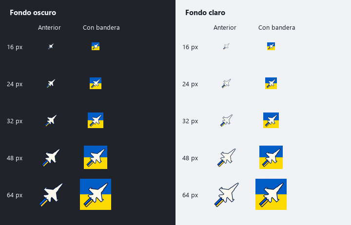

# Ukrainian flag background

The existing outlined F-16 remains the icon; the requested blue/yellow background
makes it more visible at desktop and taskbar sizes. Generated using the built-in
image editor from `04-simple-jet-outlined.png`. The final image is deliberately
opaque, with blue above yellow and no transparent margins.

Source: `07-ukraine-background.png`. Reproduce the production PNG/ICO sizes using
`../export_assets.py`; compare unchanged artwork at 16, 24, 32, 48 and 64 pixels
with `preview_sizes.py --flag`. The splash image is unchanged.

## Initial edit prompt

Use case: precise-object-edit. Asset type: DCS Escalation Windows application icon. Input image is the edit target: the previously approved ivory F-16 silhouette with dark navy outline, pointing diagonally to upper right, with two blue/yellow short parallel exhaust bars. Preserve that same aircraft silhouette, orientation, ivory fill, strong dark navy outlines and trail bars; do not redesign the fighter. Change the transparent background to a bold clean square tile with mildly rounded corners containing the Ukrainian flag: exactly two equal horizontal solid bands, Ukrainian blue #0057B7 on the top half and Ukrainian yellow #FFD700 on the bottom half. Flag fills the whole tile edge to edge; tile nearly fills canvas leaving at most 2 percent outer transparent margin. Keep the aircraft large and centered, with nose, wing tips and trail fully inside the tile, roughly 82-88 percent of tile extent. Prioritize excellent legibility at 24 and 32 pixels, strong ivory/navy silhouette against both flag colors. Flat graphic, clean sharp edges, no gradients, no texture, no shadows, no lettering, no additional symbols, no border frame. Single finished square icon, not a mockup or comparison sheet. Genuine transparent alpha only outside the rounded tile corners.

## Final background correction prompt

The first edit rendered a checkerboard instead of real alpha. It was not used
as a production asset. The following second edit produced the opaque source:

Precise background-only correction of this DCS Escalation icon. Keep the F-16 silhouette and its navy outline, ivory fill, two exhaust bars, size, position and orientation exactly unchanged. Replace ALL checkerboard pixels and rounded-corner empty margins by extending the existing flag colors right to the four straight edges of the square canvas. Result must be a completely OPAQUE square with NO rounded corners and NO margin: top half entirely Ukrainian blue #0057B7, bottom half entirely Ukrainian yellow #FFD700, horizontal divide at exactly mid-height, existing fighter overlaid unchanged. No checkerboard, no transparency, no outer border, no shadows or texture, no text. Flat solid background colors, simple high contrast desktop/taskbar app icon.
