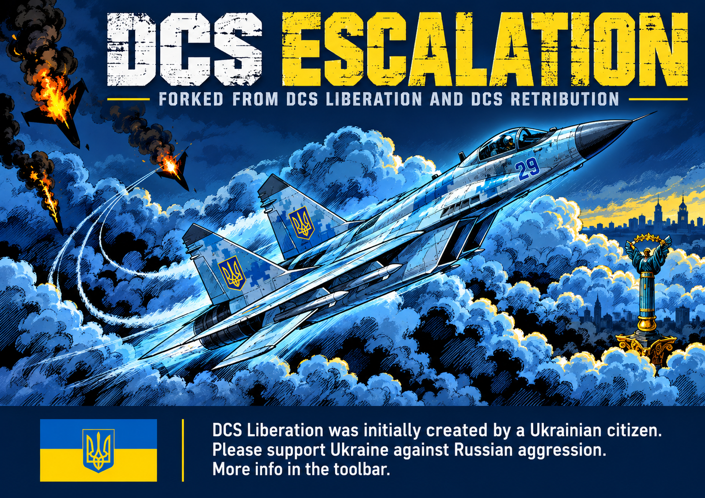
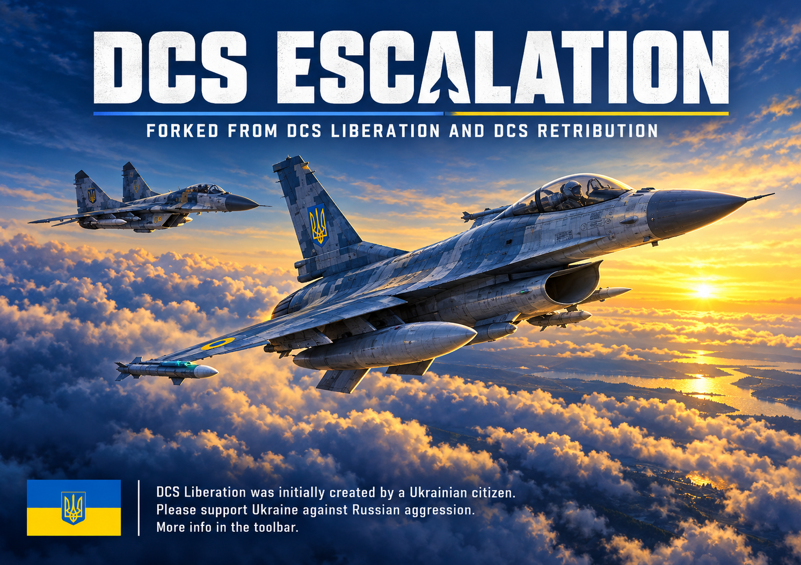
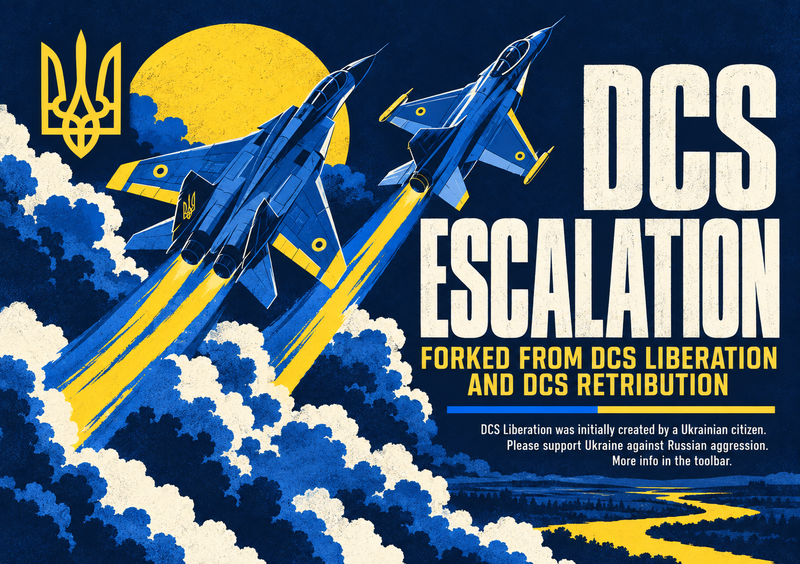

# DCS Escalation splash proposals

Preview candidates generated with the built-in image generation tool from `resources/ui/splash_screen.png`. The user accepted `02-dawn-slava-ukraini.png`. Runtime asset sizing and installation are pending the accompanying icon selection; no runtime asset or code has been replaced.

Branch: `codex/escalation-splash`.

The final selected image will need sizing for the existing splash window (647 × 458); these are high-resolution proposals. Aircraft details should receive a final visual review before shipping.

## 01-comic

### Generation prompt

Asset: finished landscape raster splash screen for DCS Escalation, aspect ratio 647:458, approximately 1296x912. Input image is the existing splash screen to redesign; retain the tribute to Ukraine and the project's lineage, but replace its brand. Typography must be extremely legible at desktop splash size, no tiny dense paragraphs. Exact title: "DCS ESCALATION". Exact subtitle: "FORKED FROM DCS LIBERATION AND DCS RETRIBUTION". Small footer, verbatim: "DCS Liberation was initially created by a Ukrainian citizen." then "Please support Ukraine against Russian aggression." then "More info in the toolbar." No other slogans, no version numbers, no copied artist signature or watermarks. Tasteful Ukrainian blue and yellow and recognizable Ukrainian trident/flag. Plausible fighter jet silhouettes and anatomy. Single complete image, not a contact sheet. Variant 1, CONTINUITY / COMIC. Reinterpret the original energetic hand-inked aviation comic: a dramatic Ukrainian MiG-29 banking upward through billowing blue clouds, dark navy ink contours, cyan metallic highlights and restrained yellow light. Keep the dynamic diagonal aircraft composition and visible flag motif of the original, but improve readability and polish with a clean navy footer and strong condensed title above. The artwork occupies the middle, typography never crosses the jet. Original illustration, not a literal copy; no burning pilots, no gore.

## 02-dawn

### Generation prompt

Asset: finished landscape raster splash screen for DCS Escalation, aspect ratio 647:458, approximately 1296x912. Input image is the existing splash screen to redesign; retain the tribute to Ukraine and the project's lineage, but replace its brand. Typography must be extremely legible at desktop splash size, no tiny dense paragraphs. Exact title: "DCS ESCALATION". Exact subtitle: "FORKED FROM DCS LIBERATION AND DCS RETRIBUTION". Small footer, verbatim: "DCS Liberation was initially created by a Ukrainian citizen." then "Please support Ukraine against Russian aggression." then "More info in the toolbar." No other slogans, no version numbers, no copied artist signature or watermarks. Tasteful Ukrainian blue and yellow and recognizable Ukrainian trident/flag. Plausible fighter jet silhouettes and anatomy. Single complete image, not a contact sheet. Variant 2, CINEMATIC DAWN. Transform the reference into an elegant painterly aviation key art tribute. A beautifully believable Ukrainian F-16 foreground, three-quarter side/top view with single vertical tail, banking gently above an ocean of clouds; a smaller Ukrainian MiG-29 companion separated behind it. Deep blue predawn sky transitions to a luminous golden horizon, evoking the Ukrainian flag through the scene itself. Restrained blue/yellow aircraft markings, hopeful, resolute, sophisticated, no explosions. Premium flight-simulator cover art with exceptional aircraft detail. Strong clean white large title in upper negative space, lineage below it, small Ukrainian flag/trident beside the readable footer. Avoid clutter, extra jets, fake cockpit glass shapes.

## 03-poster

### Generation prompt

Asset: finished landscape raster splash screen for DCS Escalation, aspect ratio 647:458, approximately 1296x912. Input image is the existing splash screen to redesign; retain the tribute to Ukraine and the project's lineage, but replace its brand. Typography must be extremely legible at desktop splash size, no tiny dense paragraphs. Exact title: "DCS ESCALATION". Exact subtitle: "FORKED FROM DCS LIBERATION AND DCS RETRIBUTION". Small footer, verbatim: "DCS Liberation was initially created by a Ukrainian citizen." then "Please support Ukraine against Russian aggression." then "More info in the toolbar." No other slogans, no version numbers, no copied artist signature or watermarks. Tasteful Ukrainian blue and yellow and recognizable Ukrainian trident/flag. Plausible fighter jet silhouettes and anatomy. Single complete image, not a contact sheet. Variant 3, GRAPHIC AVIATION POSTER. Bold original screen-printed poster, refined modern illustration, flat ink shapes with subtle paper grain, dark midnight navy, cobalt blue, sunflower yellow and ivory only. Two recognizable Ukrainian fighter jets, one MiG-29 and one F-16, viewed from above on a diagonal climb; sweeping blue and yellow flight trails and simplified cloud masses create a strong geometric composition. Clean generous hierarchy, huge condensed ivory title, yellow lineage subtitle, compact legible footer on navy. Integrate a small precise Ukrainian trident, no ornamental fake heraldry. Dramatic but restrained, strong silhouette at small size, no gradients or photorealism, no burning aircraft.
